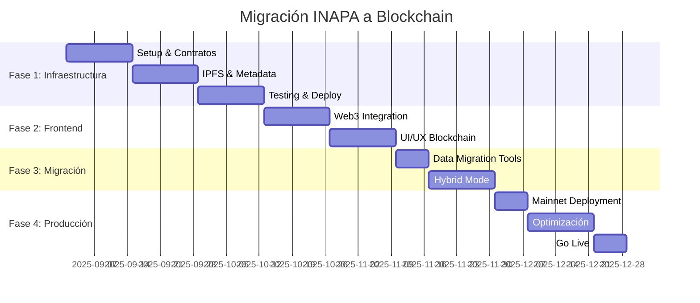

# MIGRACIÓN A BLOCKCHAIN - Sistema de Asistencias INAPA

## Tabla de Contenidos
1. [Visión General de la Migración](#visión-general-de-la-migración)
2. [Arquitectura Blockchain Propuesta](#arquitectura-blockchain-propuesta)
3. [Componentes a Migrar](#componentes-a-migrar)
4. [Implementación por Fases](#implementación-por-fases)
5. [Smart Contracts](#smart-contracts)
6. [Integración con Web3](#integración-con-web3)
7. [Consideraciones Técnicas](#consideraciones-técnicas)
8. [Plan de Migración Completo](#plan-de-migración-completo)

---

## Visión General de la Migración

### Objetivos de la Blockchain Integration

#### **¿Por qué Blockchain?**
- **Inmutabilidad:** Registros de asistencia que no pueden ser alterados
- **Transparencia:** Auditoría pública de todos los eventos y asistencias
- **Descentralización:** Eliminar dependencia de servidores centralizados
- **Verificabilidad:** Certificados de asistencia criptográficamente verificables
- **Interoperabilidad:** Integración con otros sistemas gubernamentales

#### **Beneficios Específicos para INAPA**
- **Certificación Digital:** NFTs como certificados de asistencia oficiales
- **Auditoría Gubernamental:** Transparencia total en eventos públicos
- **Reducción de Fraude:** Imposibilidad de falsificar registros
- **Eficiencia Administrativa:** Automatización mediante smart contracts
- **Archivo Permanente:** Histórico inmutable de capacitaciones

### Arquitectura Híbrida Recomendada

```
┌─────────────────┐    ┌─────────────────┐    ┌─────────────────┐
│   Frontend      │    │   Backend       │    │   Blockchain    │
│   (Actual)      │◄──►│   (Híbrido)     │◄──►│   (Nueva)       │
├─────────────────┤    ├─────────────────┤    ├─────────────────┤
│ • Dashboard     │    │ • APIs REST     │    │ • Smart         │
│ • Formularios   │    │ • Web3          │    │   Contracts     │
│ • Reportes      │    │   Integration   │    │ • IPFS Storage  │
│ • QR Codes      │    │ • Cache Layer   │    │ • Event Logs    │
└─────────────────┘    └─────────────────┘    └─────────────────┘
```

---

## Arquitectura Blockchain Propuesta

### Stack Tecnológico Recomendado

#### **Blockchain Platform: Polygon (MATIC)**
**Justificación:**
- ✅ Costos bajos de transacción (< $0.01 USD)
- ✅ Compatible con Ethereum ecosystem
- ✅ Escalabilidad probada (65,000+ TPS)
- ✅ Soporte gubernamental en varios países
- ✅ Herramientas maduras de desarrollo

#### **Alternativas Consideradas:**
1. **Ethereum Mainnet** - ❌ Costos altos
2. **BSC (Binance Smart Chain)** - ⚠️ Más centralizada
3. **Solana** - ⚠️ Ecosistema menos maduro para NFTs
4. **Hyperledger Fabric** - ⚠️ Privada, no cumple objetivos de transparencia

### Infraestructura de Desarrollo

#### **Framework y Librerías**
```json
{
  "blockchain": {
    "hardhat": "^2.19.0",
    "ethers": "^6.8.0",
    "@openzeppelin/contracts": "^5.0.0",
    "@chainlink/contracts": "^0.8.0"
  },
  "web3_integration": {
    "wagmi": "^2.0.0",
    "viem": "^1.20.0",
    "@rainbow-me/rainbowkit": "^2.0.0",
    "web3modal": "^3.3.0"
  },
  "storage": {
    "@pinata/sdk": "^2.1.0",
    "ipfs-http-client": "^60.0.0",
    "arweave": "^1.14.0"
  },
  "development": {
    "@nomicfoundation/hardhat-toolbox": "^4.0.0",
    "hardhat-gas-reporter": "^1.0.9",
    "solidity-coverage": "^0.8.5"
  }
}
```

#### **Servicios de Infraestructura**
- **RPC Provider:** Alchemy o Infura
- **IPFS Pinning:** Pinata o NFT.Storage
- **Indexing:** The Graph Protocol
- **Analytics:** Dune Analytics
- **Monitoring:** Tenderly

---

## Componentes a Migrar

### 1. Gestión de Eventos

#### **Estado Actual (Base de Datos)**
```sql
-- Table: events
CREATE TABLE events (
  id VARCHAR PRIMARY KEY,
  googleEventId VARCHAR UNIQUE,
  title VARCHAR NOT NULL,
  description TEXT,
  location VARCHAR,
  startAt DATETIME,
  endAt DATETIME,
  organizerId INT,
  status VARCHAR DEFAULT 'active'
);
```

#### **Nuevo Estado (Smart Contract)**
```solidity
// Contract: EventManager.sol
struct Event {
    uint256 eventId;
    string title;
    string description;
    string location;
    uint256 startTime;
    uint256 endTime;
    address organizer;
    EventStatus status;
    string metadataURI; // IPFS hash
    uint256 maxAttendees;
    uint256 currentAttendees;
}

enum EventStatus { Active, Cancelled, Completed, Draft }
```

### 2. Registro de Asistencias

#### **Estado Actual (Base de Datos)**
```sql
-- Table: checkins
CREATE TABLE checkins (
  id VARCHAR PRIMARY KEY,
  eventId VARCHAR,
  cedula VARCHAR,
  nombre VARCHAR,
  correo VARCHAR,
  createdAt DATETIME
);
```

#### **Nuevo Estado (Smart Contract + NFT)**
```solidity
// Contract: AttendanceNFT.sol (ERC721)
struct AttendanceRecord {
    uint256 eventId;
    string attendeeCedula;
    string attendeeName;
    string attendeeEmail;
    uint256 checkInTime;
    bool verified;
    string certificateURI; // IPFS metadata
}

// Mapping: tokenId => AttendanceRecord
mapping(uint256 => AttendanceRecord) public attendanceRecords;
```

### 3. Verificación de Identidad

#### **Sistema Actual vs. Blockchain**

| Aspecto | Sistema Actual | Blockchain |
|---------|---------------|------------|
| **Validación Cédula** | Base de datos local | Smart contract + Oracle |
| **Prevención Duplicados** | Índice único SQL | Mapping en contrato |
| **Auditoría** | Logs en BD | Event logs inmutables |
| **Verificación** | API interna | Función pública on-chain |

### 4. Certificados de Asistencia

#### **NFT Metadata Standard (ERC721)**
```json
{
  "name": "Certificado de Asistencia - [Event Name]",
  "description": "Certificado oficial de asistencia al evento [Event Name] organizado por INAPA",
  "image": "ipfs://QmXXXXX/certificate.png",
  "external_url": "https://attendance.inapa.gob.do/certificate/[tokenId]",
  "attributes": [
    {
      "trait_type": "Event Name",
      "value": "[Event Title]"
    },
    {
      "trait_type": "Date",
      "value": "[Event Date]"
    },
    {
      "trait_type": "Location",
      "value": "[Event Location]"
    },
    {
      "trait_type": "Attendee ID",
      "value": "[Cedula]"
    },
    {
      "trait_type": "Organizer",
      "value": "INAPA"
    },
    {
      "trait_type": "Certificate Type",
      "value": "Official Attendance"
    }
  ],
  "certificate_data": {
    "event_id": "[Event ID]",
    "attendee_cedula": "[Cedula]",
    "check_in_time": "[Unix Timestamp]",
    "verification_hash": "[SHA256 Hash]"
  }
}
```

---

## Smart Contracts

### 1. EventManager Contract

```solidity
// SPDX-License-Identifier: MIT
pragma solidity ^0.8.19;

import "@openzeppelin/contracts/access/AccessControl.sol";
import "@openzeppelin/contracts/security/Pausable.sol";
import "@openzeppelin/contracts/security/ReentrancyGuard.sol";

contract INAPAEventManager is AccessControl, Pausable, ReentrancyGuard {
    bytes32 public constant ORGANIZER_ROLE = keccak256("ORGANIZER_ROLE");
    bytes32 public constant ADMIN_ROLE = keccak256("ADMIN_ROLE");
    
    struct Event {
        uint256 eventId;
        string title;
        string description;
        string location;
        uint256 startTime;
        uint256 endTime;
        address organizer;
        EventStatus status;
        string metadataURI;
        uint256 maxAttendees;
        uint256 currentAttendees;
        bool requiresApproval;
        uint256 createdAt;
    }
    
    enum EventStatus { Draft, Active, Cancelled, Completed }
    
    mapping(uint256 => Event) public events;
    mapping(uint256 => mapping(string => bool)) public hasAttended; // eventId => cedula => attended
    mapping(address => uint256[]) public organizerEvents;
    
    uint256 private _eventIdCounter;
    
    event EventCreated(uint256 indexed eventId, address indexed organizer, string title);
    event EventUpdated(uint256 indexed eventId, EventStatus status);
    event AttendanceRegistered(uint256 indexed eventId, string cedula, address attendee);
    
    constructor() {
        _grantRole(DEFAULT_ADMIN_ROLE, msg.sender);
        _grantRole(ADMIN_ROLE, msg.sender);
    }
    
    function createEvent(
        string memory _title,
        string memory _description,
        string memory _location,
        uint256 _startTime,
        uint256 _endTime,
        uint256 _maxAttendees,
        string memory _metadataURI,
        bool _requiresApproval
    ) external onlyRole(ORGANIZER_ROLE) returns (uint256) {
        require(_startTime > block.timestamp, "Start time must be in the future");
        require(_endTime > _startTime, "End time must be after start time");
        require(bytes(_title).length > 0, "Title cannot be empty");
        
        uint256 eventId = _eventIdCounter++;
        
        events[eventId] = Event({
            eventId: eventId,
            title: _title,
            description: _description,
            location: _location,
            startTime: _startTime,
            endTime: _endTime,
            organizer: msg.sender,
            status: _requiresApproval ? EventStatus.Draft : EventStatus.Active,
            metadataURI: _metadataURI,
            maxAttendees: _maxAttendees,
            currentAttendees: 0,
            requiresApproval: _requiresApproval,
            createdAt: block.timestamp
        });
        
        organizerEvents[msg.sender].push(eventId);
        
        emit EventCreated(eventId, msg.sender, _title);
        return eventId;
    }
    
    function registerAttendance(
        uint256 _eventId,
        string memory _cedula,
        string memory _name,
        string memory _email
    ) external nonReentrant {
        Event storage eventData = events[_eventId];
        require(eventData.eventId == _eventId, "Event does not exist");
        require(eventData.status == EventStatus.Active, "Event is not active");
        require(block.timestamp >= eventData.startTime, "Event has not started");
        require(block.timestamp <= eventData.endTime + 1 hours, "Event registration closed");
        require(!hasAttended[_eventId][_cedula], "Already registered for this event");
        require(eventData.currentAttendees < eventData.maxAttendees, "Event is full");
        require(_validateCedula(_cedula), "Invalid cedula format");
        
        hasAttended[_eventId][_cedula] = true;
        events[_eventId].currentAttendees++;
        
        emit AttendanceRegistered(_eventId, _cedula, msg.sender);
        
        // Mint NFT certificate (call to AttendanceNFT contract)
        _mintAttendanceCertificate(_eventId, _cedula, _name, _email);
    }
    
    function updateEventStatus(uint256 _eventId, EventStatus _status) 
        external 
        onlyRole(ADMIN_ROLE) 
    {
        require(events[_eventId].eventId == _eventId, "Event does not exist");
        events[_eventId].status = _status;
        emit EventUpdated(_eventId, _status);
    }
    
    function getEvent(uint256 _eventId) external view returns (Event memory) {
        require(events[_eventId].eventId == _eventId, "Event does not exist");
        return events[_eventId];
    }
    
    function getOrganizerEvents(address _organizer) external view returns (uint256[] memory) {
        return organizerEvents[_organizer];
    }
    
    function _validateCedula(string memory _cedula) private pure returns (bool) {
        bytes memory cedulaBytes = bytes(_cedula);
        if (cedulaBytes.length != 11) return false;
        
        for (uint i = 0; i < cedulaBytes.length; i++) {
            if (cedulaBytes[i] < 0x30 || cedulaBytes[i] > 0x39) return false;
        }
        return true;
    }
    
    function _mintAttendanceCertificate(
        uint256 _eventId,
        string memory _cedula,
        string memory _name,
        string memory _email
    ) private {
        // Interface call to AttendanceNFT contract
        // Implementation depends on contract architecture
    }
}
```

### 2. AttendanceNFT Contract

```solidity
// SPDX-License-Identifier: MIT
pragma solidity ^0.8.19;

import "@openzeppelin/contracts/token/ERC721/ERC721.sol";
import "@openzeppelin/contracts/token/ERC721/extensions/ERC721URIStorage.sol";
import "@openzeppelin/contracts/access/AccessControl.sol";
import "@openzeppelin/contracts/utils/Counters.sol";

contract INAPAAttendanceNFT is ERC721, ERC721URIStorage, AccessControl {
    using Counters for Counters.Counter;
    
    bytes32 public constant MINTER_ROLE = keccak256("MINTER_ROLE");
    
    Counters.Counter private _tokenIdCounter;
    
    struct AttendanceRecord {
        uint256 eventId;
        string attendeeCedula;
        string attendeeName;
        string attendeeEmail;
        uint256 checkInTime;
        bool verified;
        address organizer;
    }
    
    mapping(uint256 => AttendanceRecord) public attendanceRecords;
    mapping(string => mapping(uint256 => uint256)) public cedulaEventToToken; // cedula => eventId => tokenId
    mapping(uint256 => uint256[]) public eventTokens; // eventId => tokenIds[]
    
    event CertificateMinted(
        uint256 indexed tokenId,
        uint256 indexed eventId,
        string cedula,
        address indexed organizer
    );
    
    constructor() ERC721("INAPA Attendance Certificate", "INAPA-CERT") {
        _grantRole(DEFAULT_ADMIN_ROLE, msg.sender);
        _grantRole(MINTER_ROLE, msg.sender);
    }
    
    function mintCertificate(
        address _to,
        uint256 _eventId,
        string memory _cedula,
        string memory _name,
        string memory _email,
        string memory _tokenURI,
        address _organizer
    ) external onlyRole(MINTER_ROLE) returns (uint256) {
        require(cedulaEventToToken[_cedula][_eventId] == 0, "Certificate already exists");
        
        uint256 tokenId = _tokenIdCounter.current();
        _tokenIdCounter.increment();
        
        _safeMint(_to, tokenId);
        _setTokenURI(tokenId, _tokenURI);
        
        attendanceRecords[tokenId] = AttendanceRecord({
            eventId: _eventId,
            attendeeCedula: _cedula,
            attendeeName: _name,
            attendeeEmail: _email,
            checkInTime: block.timestamp,
            verified: true,
            organizer: _organizer
        });
        
        cedulaEventToToken[_cedula][_eventId] = tokenId;
        eventTokens[_eventId].push(tokenId);
        
        emit CertificateMinted(tokenId, _eventId, _cedula, _organizer);
        return tokenId;
    }
    
    function verifyCertificate(uint256 _tokenId) external view returns (
        bool exists,
        AttendanceRecord memory record
    ) {
        exists = _exists(_tokenId);
        if (exists) {
            record = attendanceRecords[_tokenId];
        }
    }
    
    function getCertificatesByCedula(string memory _cedula, uint256 _eventId) 
        external 
        view 
        returns (uint256) 
    {
        return cedulaEventToToken[_cedula][_eventId];
    }
    
    function getEventCertificates(uint256 _eventId) 
        external 
        view 
        returns (uint256[] memory) 
    {
        return eventTokens[_eventId];
    }
    
    function tokenURI(uint256 tokenId)
        public
        view
        override(ERC721, ERC721URIStorage)
        returns (string memory)
    {
        return super.tokenURI(tokenId);
    }
    
    function supportsInterface(bytes4 interfaceId)
        public
        view
        override(ERC721, ERC721URIStorage, AccessControl)
        returns (bool)
    {
        return super.supportsInterface(interfaceId);
    }
}
```

### 3. Oracle Contract para Validación

```solidity
// SPDX-License-Identifier: MIT
pragma solidity ^0.8.19;

import "@chainlink/contracts/src/v0.8/interfaces/AggregatorV3Interface.sol";
import "@openzeppelin/contracts/access/AccessControl.sol";

contract INAPAIdentityOracle is AccessControl {
    bytes32 public constant ORACLE_ROLE = keccak256("ORACLE_ROLE");
    
    struct IdentityVerification {
        string cedula;
        bool verified;
        uint256 verifiedAt;
        address verifiedBy;
    }
    
    mapping(string => IdentityVerification) public verifications;
    mapping(address => bool) public authorizedValidators;
    
    event IdentityVerified(string indexed cedula, address indexed validator);
    event ValidatorAuthorized(address indexed validator);
    
    constructor() {
        _grantRole(DEFAULT_ADMIN_ROLE, msg.sender);
        _grantRole(ORACLE_ROLE, msg.sender);
    }
    
    function verifyIdentity(string memory _cedula) 
        external 
        onlyRole(ORACLE_ROLE) 
        returns (bool) 
    {
        require(bytes(_cedula).length == 11, "Invalid cedula length");
        
        // External API call to TSS (Sistema de Seguridad Social)
        // This would be implemented through Chainlink Functions
        bool isValid = _callTSSAPI(_cedula);
        
        if (isValid) {
            verifications[_cedula] = IdentityVerification({
                cedula: _cedula,
                verified: true,
                verifiedAt: block.timestamp,
                verifiedBy: msg.sender
            });
            
            emit IdentityVerified(_cedula, msg.sender);
        }
        
        return isValid;
    }
    
    function isVerified(string memory _cedula) external view returns (bool) {
        return verifications[_cedula].verified;
    }
    
    function _callTSSAPI(string memory _cedula) private pure returns (bool) {
        // Placeholder for Chainlink Functions implementation
        // Would call external API to verify cedula against TSS database
        return bytes(_cedula).length == 11; // Simplified validation
    }
}
```

---

## Integración con Web3

### 1. Frontend Integration

#### **Wallet Connection Setup**
```typescript
// lib/web3/config.ts
import { getDefaultConfig } from '@rainbow-me/rainbowkit'
import { polygon, polygonMumbai } from 'wagmi/chains'

export const web3Config = getDefaultConfig({
  appName: 'INAPA Attendance System',
  projectId: process.env.NEXT_PUBLIC_WALLET_CONNECT_PROJECT_ID!,
  chains: [polygon, polygonMumbai],
  ssr: true,
})

// Smart contract addresses
export const CONTRACTS = {
  EVENT_MANAGER: process.env.NEXT_PUBLIC_EVENT_MANAGER_ADDRESS!,
  ATTENDANCE_NFT: process.env.NEXT_PUBLIC_ATTENDANCE_NFT_ADDRESS!,
  IDENTITY_ORACLE: process.env.NEXT_PUBLIC_IDENTITY_ORACLE_ADDRESS!,
} as const
```

#### **Web3 Provider Setup**
```typescript
// app/layout.tsx
import { Web3Provider } from '@/components/Web3Provider'

export default function RootLayout({
  children,
}: {
  children: React.ReactNode
}) {
  return (
    <html lang="es">
      <body>
        <Web3Provider>
          {children}
        </Web3Provider>
      </body>
    </html>
  )
}
```

```typescript
// components/Web3Provider.tsx
'use client'
import { RainbowKitProvider } from '@rainbow-me/rainbowkit'
import { WagmiConfig } from 'wagmi'
import { QueryClient, QueryClientProvider } from '@tanstack/react-query'
import { web3Config } from '@/lib/web3/config'

const queryClient = new QueryClient()

export function Web3Provider({ children }: { children: React.ReactNode }) {
  return (
    <WagmiConfig config={web3Config}>
      <QueryClientProvider client={queryClient}>
        <RainbowKitProvider>
          {children}
        </RainbowKitProvider>
      </QueryClientProvider>
    </WagmiConfig>
  )
}
```

### 2. Smart Contract Interaction

#### **Event Management Service**
```typescript
// lib/web3/eventManager.ts
import { useContractWrite, useContractRead } from 'wagmi'
import { CONTRACTS } from './config'
import eventManagerABI from './abis/EventManager.json'

export function useCreateEvent() {
  return useContractWrite({
    address: CONTRACTS.EVENT_MANAGER,
    abi: eventManagerABI,
    functionName: 'createEvent',
  })
}

export function useRegisterAttendance() {
  return useContractWrite({
    address: CONTRACTS.EVENT_MANAGER,
    abi: eventManagerABI,
    functionName: 'registerAttendance',
  })
}

export function useGetEvent(eventId: bigint) {
  return useContractRead({
    address: CONTRACTS.EVENT_MANAGER,
    abi: eventManagerABI,
    functionName: 'getEvent',
    args: [eventId],
  })
}

// Service class for complex operations
export class EventManagerService {
  private contract: Contract
  
  constructor(signer: Signer) {
    this.contract = new Contract(CONTRACTS.EVENT_MANAGER, eventManagerABI, signer)
  }
  
  async createEvent(eventData: CreateEventParams): Promise<TransactionResponse> {
    const tx = await this.contract.createEvent(
      eventData.title,
      eventData.description,
      eventData.location,
      eventData.startTime,
      eventData.endTime,
      eventData.maxAttendees,
      eventData.metadataURI,
      eventData.requiresApproval
    )
    return tx
  }
  
  async registerAttendance(
    eventId: bigint,
    cedula: string,
    name: string,
    email: string
  ): Promise<TransactionResponse> {
    const tx = await this.contract.registerAttendance(eventId, cedula, name, email)
    return tx
  }
  
  async getEventAttendees(eventId: bigint): Promise<string[]> {
    // Implementation would parse event logs
    const filter = this.contract.filters.AttendanceRegistered(eventId)
    const events = await this.contract.queryFilter(filter)
    return events.map(event => event.args?.cedula || '')
  }
}
```

#### **NFT Certificate Service**
```typescript
// lib/web3/attendanceNFT.ts
import { useContractRead } from 'wagmi'
import { CONTRACTS } from './config'
import attendanceNFTABI from './abis/AttendanceNFT.json'

export function useVerifyCertificate(tokenId: bigint) {
  return useContractRead({
    address: CONTRACTS.ATTENDANCE_NFT,
    abi: attendanceNFTABI,
    functionName: 'verifyCertificate',
    args: [tokenId],
  })
}

export function useGetCertificatesByCedula(cedula: string, eventId: bigint) {
  return useContractRead({
    address: CONTRACTS.ATTENDANCE_NFT,
    abi: attendanceNFTABI,
    functionName: 'getCertificatesByCedula',
    args: [cedula, eventId],
  })
}

// Service for NFT operations
export class AttendanceNFTService {
  private contract: Contract
  
  constructor(provider: Provider) {
    this.contract = new Contract(CONTRACTS.ATTENDANCE_NFT, attendanceNFTABI, provider)
  }
  
  async getCertificateMetadata(tokenId: bigint): Promise<CertificateMetadata> {
    const tokenURI = await this.contract.tokenURI(tokenId)
    const response = await fetch(tokenURI.replace('ipfs://', 'https://ipfs.io/ipfs/'))
    return response.json()
  }
  
  async generateCertificatePDF(tokenId: bigint): Promise<Blob> {
    const record = await this.contract.attendanceRecords(tokenId)
    const metadata = await this.getCertificateMetadata(tokenId)
    
    // Generate PDF using existing PDF service
    return await PDFService.generateCertificatePDF({
      tokenId: tokenId.toString(),
      attendanceRecord: record,
      metadata,
    })
  }
}
```

### 3. IPFS Integration

#### **IPFS Service for Metadata Storage**
```typescript
// lib/ipfs/service.ts
import { PinataSDK } from 'pinata-web3'

export class IPFSService {
  private pinata: PinataSDK
  
  constructor() {
    this.pinata = new PinataSDK({
      pinataJwt: process.env.PINATA_JWT!,
      pinataGateway: process.env.PINATA_GATEWAY!,
    })
  }
  
  async uploadEventMetadata(eventData: EventMetadata): Promise<string> {
    try {
      const metadata = {
        name: eventData.title,
        description: eventData.description,
        image: eventData.imageUrl,
        external_url: `${process.env.NEXT_PUBLIC_BASE_URL}/events/${eventData.id}`,
        attributes: [
          { trait_type: "Organizer", value: "INAPA" },
          { trait_type: "Location", value: eventData.location },
          { trait_type: "Start Date", value: eventData.startDate },
          { trait_type: "End Date", value: eventData.endDate },
        ],
        event_data: {
          id: eventData.id,
          organizer_address: eventData.organizerAddress,
          max_attendees: eventData.maxAttendees,
          requirements: eventData.requirements,
        }
      }
      
      const result = await this.pinata.upload.json(metadata)
      return `ipfs://${result.IpfsHash}`
    } catch (error) {
      console.error('Error uploading to IPFS:', error)
      throw error
    }
  }
  
  async uploadCertificateMetadata(certificateData: CertificateData): Promise<string> {
    try {
      // Generate certificate image
      const certificateImage = await this.generateCertificateImage(certificateData)
      const imageUpload = await this.pinata.upload.file(certificateImage)
      
      const metadata = {
        name: `Certificado de Asistencia - ${certificateData.eventTitle}`,
        description: `Certificado oficial de asistencia al evento "${certificateData.eventTitle}" organizado por INAPA`,
        image: `ipfs://${imageUpload.IpfsHash}`,
        external_url: `${process.env.NEXT_PUBLIC_BASE_URL}/certificate/${certificateData.tokenId}`,
        attributes: [
          { trait_type: "Event Name", value: certificateData.eventTitle },
          { trait_type: "Date", value: certificateData.eventDate },
          { trait_type: "Location", value: certificateData.eventLocation },
          { trait_type: "Attendee ID", value: certificateData.attendeeCedula },
          { trait_type: "Organizer", value: "INAPA" },
          { trait_type: "Certificate Type", value: "Official Attendance" }
        ],
        certificate_data: {
          event_id: certificateData.eventId,
          attendee_cedula: certificateData.attendeeCedula,
          attendee_name: certificateData.attendeeName,
          check_in_time: certificateData.checkInTime,
          verification_hash: certificateData.verificationHash,
          blockchain_tx: certificateData.mintTxHash,
        }
      }
      
      const result = await this.pinata.upload.json(metadata)
      return `ipfs://${result.IpfsHash}`
    } catch (error) {
      console.error('Error uploading certificate to IPFS:', error)
      throw error
    }
  }
  
  private async generateCertificateImage(data: CertificateData): Promise<File> {
    // Use Canvas API or image generation library
    const canvas = document.createElement('canvas')
    const ctx = canvas.getContext('2d')!
    
    canvas.width = 800
    canvas.height = 600
    
    // Draw certificate background
    ctx.fillStyle = '#ffffff'
    ctx.fillRect(0, 0, canvas.width, canvas.height)
    
    // Add INAPA logo
    // Add certificate text
    // Add QR code for verification
    
    return new Promise((resolve) => {
      canvas.toBlob((blob) => {
        resolve(new File([blob!], 'certificate.png', { type: 'image/png' }))
      })
    })
  }
}
```

### 4. Hybrid Database Integration

#### **Blockchain-Database Sync Service**
```typescript
// lib/web3/sync.ts
export class BlockchainSyncService {
  private eventManager: Contract
  private attendanceNFT: Contract
  
  constructor() {
    this.eventManager = new Contract(CONTRACTS.EVENT_MANAGER, eventManagerABI, provider)
    this.attendanceNFT = new Contract(CONTRACTS.ATTENDANCE_NFT, attendanceNFTABI, provider)
  }
  
  async syncEventFromBlockchain(eventId: bigint): Promise<void> {
    try {
      // Get event data from blockchain
      const eventData = await this.eventManager.getEvent(eventId)
      
      // Update local database
      await prisma.event.upsert({
        where: { blockchainEventId: eventId.toString() },
        update: {
          title: eventData.title,
          description: eventData.description,
          location: eventData.location,
          startAt: new Date(Number(eventData.startTime) * 1000),
          endAt: new Date(Number(eventData.endTime) * 1000),
          status: this.mapBlockchainStatus(eventData.status),
          maxAttendees: Number(eventData.maxAttendees),
          currentAttendees: Number(eventData.currentAttendees),
        },
        create: {
          id: crypto.randomUUID(),
          blockchainEventId: eventId.toString(),
          title: eventData.title,
          description: eventData.description,
          location: eventData.location,
          startAt: new Date(Number(eventData.startTime) * 1000),
          endAt: new Date(Number(eventData.endTime) * 1000),
          status: this.mapBlockchainStatus(eventData.status),
          organizerId: await this.getOrCreateOrganizer(eventData.organizer),
          formToken: this.generateFormToken(),
          maxAttendees: Number(eventData.maxAttendees),
          currentAttendees: Number(eventData.currentAttendees),
        }
      })
      
      console.log(`Event ${eventId} synced successfully`)
    } catch (error) {
      console.error(`Error syncing event ${eventId}:`, error)
      throw error
    }
  }
  
  async syncAttendanceFromBlockchain(tokenId: bigint): Promise<void> {
    try {
      // Get attendance record from NFT contract
      const [exists, record] = await this.attendanceNFT.verifyCertificate(tokenId)
      
      if (!exists) {
        throw new Error(`Certificate ${tokenId} does not exist`)
      }
      
      // Update local database
      await prisma.checkin.upsert({
        where: { blockchainTokenId: tokenId.toString() },
        update: {
          cedula: record.attendeeCedula,
          nombre: record.attendeeName,
          correo: record.attendeeEmail,
          verified: record.verified,
        },
        create: {
          id: crypto.randomUUID(),
          blockchainTokenId: tokenId.toString(),
          eventId: await this.getEventIdByBlockchainId(record.eventId),
          cedula: record.attendeeCedula,
          nombre: record.attendeeName,
          correo: record.attendeeEmail,
          createdAt: new Date(Number(record.checkInTime) * 1000),
          verified: record.verified,
        }
      })
      
      console.log(`Attendance ${tokenId} synced successfully`)
    } catch (error) {
      console.error(`Error syncing attendance ${tokenId}:`, error)
      throw error
    }
  }
  
  private mapBlockchainStatus(status: number): string {
    const statusMap = {
      0: 'draft',
      1: 'active',
      2: 'cancelled',
      3: 'completed'
    }
    return statusMap[status as keyof typeof statusMap] || 'active'
  }
  
  private async getOrCreateOrganizer(address: string): Promise<number> {
    // Implementation to map blockchain address to organizer
    // Could use ENS resolution or address-to-email mapping
    return 1 // Placeholder
  }
  
  private async getEventIdByBlockchainId(blockchainEventId: bigint): Promise<string> {
    const event = await prisma.event.findUnique({
      where: { blockchainEventId: blockchainEventId.toString() }
    })
    
    if (!event) {
      throw new Error(`Event with blockchain ID ${blockchainEventId} not found`)
    }
    
    return event.id
  }
  
  private generateFormToken(): string {
    return crypto.randomUUID()
  }
}
```

---

## Implementación por Fases

### Fase 1: Infraestructura Blockchain (4-6 semanas)

#### **Semana 1-2: Setup y Contratos Base**
```bash
# Inicialización del proyecto blockchain
mkdir inapa-blockchain
cd inapa-blockchain
npm init -y
npm install hardhat @nomicfoundation/hardhat-toolbox @openzeppelin/contracts

# Setup Hardhat
npx hardhat init
```

**Entregables:**
- ✅ Configuración de Hardhat
- ✅ Smart contracts básicos (EventManager, AttendanceNFT)
- ✅ Tests unitarios para contratos
- ✅ Deployment scripts para testnet

#### **Semana 3-4: IPFS y Metadata**
**Entregables:**
- ✅ Integración con Pinata/IPFS
- ✅ Generación automática de metadata
- ✅ Sistema de templates para certificados
- ✅ Testing de subida/bajada de IPFS

#### **Semana 5-6: Testing y Deployment**
**Entregables:**
- ✅ Deployment en Polygon Mumbai (testnet)
- ✅ Verificación de contratos en Polygonscan
- ✅ Testing end-to-end
- ✅ Documentación técnica

### Fase 2: Integración Frontend (3-4 semanas)

#### **Semana 1-2: Web3 Integration**
**Entregables:**
- ✅ RainbowKit + Wagmi setup
- ✅ Wallet connection flows
- ✅ Contract interaction hooks
- ✅ Error handling y UX

#### **Semana 3-4: UI/UX Blockchain**
**Entregables:**
- ✅ Formularios con Web3 validation
- ✅ Transaction status tracking
- ✅ NFT certificate viewer
- ✅ Blockchain explorers links

### Fase 3: Migración de Datos (2-3 semanas)

#### **Semana 1: Data Migration Tools**
**Entregables:**
- ✅ Scripts de migración de eventos existentes
- ✅ Migración de check-ins históricos como NFTs
- ✅ Validación de integridad de datos
- ✅ Rollback procedures

#### **Semana 2-3: Hybrid Mode**
**Entregables:**
- ✅ Sistema híbrido funcional
- ✅ Sync automático blockchain ↔ database
- ✅ Testing de consistencia
- ✅ Performance optimization

### Fase 4: Producción y Optimización (2-3 semanas)

#### **Deployment en Mainnet**
**Entregables:**
- ✅ Deployment en Polygon Mainnet
- ✅ Gas optimization
- ✅ Monitoring y alertas
- ✅ Backup y recovery procedures

---

## Consideraciones Técnicas

### 1. Gas Optimization

#### **Estrategias de Optimización**
```solidity
// Example: Packed structs for gas efficiency
struct PackedEvent {
    uint128 eventId;        // Instead of uint256
    uint64 startTime;       // Unix timestamp fits in uint64
    uint64 endTime;
    uint32 maxAttendees;    // 4B attendees should be enough
    uint32 currentAttendees;
    EventStatus status;     // uint8 enum
    address organizer;      // 20 bytes
    // Total: 32 + 32 bytes = 2 storage slots instead of 6
}

// Gas-efficient batch operations
function batchRegisterAttendance(
    uint256 _eventId,
    string[] calldata _cedulas,
    string[] calldata _names,
    string[] calldata _emails
) external {
    require(_cedulas.length == _names.length && _names.length == _emails.length, "Array length mismatch");
    require(_cedulas.length <= 50, "Batch size too large"); // Prevent gas limit issues
    
    for (uint i = 0; i < _cedulas.length; i++) {
        _registerSingleAttendance(_eventId, _cedulas[i], _names[i], _emails[i]);
    }
}
```

#### **Estimación de Costos (Polygon)**
| Operación | Gas Estimado | Costo en MATIC (~$0.50) | Costo en USD |
|-----------|--------------|--------------------------|--------------|
| Crear Evento | ~250,000 | 0.125 MATIC | ~$0.06 |
| Registrar Asistencia | ~150,000 | 0.075 MATIC | ~$0.04 |
| Mint NFT Certificate | ~200,000 | 0.100 MATIC | ~$0.05 |
| Verificar Certificado | ~50,000 | 0.025 MATIC | ~$0.01 |

### 2. Security Considerations

#### **Vulnerability Assessment**
```solidity
// Reentrancy protection
contract SecureEventManager is ReentrancyGuard {
    function registerAttendance(...) external nonReentrant {
        // Safe from reentrancy attacks
    }
}

// Access control
modifier onlyVerifiedOrganizer() {
    require(hasRole(ORGANIZER_ROLE, msg.sender), "Not authorized");
    require(verifiedOrganizers[msg.sender], "Organizer not verified");
    _;
}

// Input validation
function _validateEventData(Event memory _event) private pure {
    require(bytes(_event.title).length > 0 && bytes(_event.title).length <= 200, "Invalid title");
    require(_event.startTime > block.timestamp, "Invalid start time");
    require(_event.endTime > _event.startTime, "Invalid end time");
    require(_event.maxAttendees > 0 && _event.maxAttendees <= 10000, "Invalid max attendees");
}
```

#### **Security Best Practices**
- ✅ Multi-signature wallet for admin functions
- ✅ Timelock for critical operations
- ✅ Rate limiting on public functions
- ✅ Formal verification for critical paths
- ✅ Bug bounty program

### 3. Scalability Solutions

#### **Layer 2 Integration**
```typescript
// Polygon integration for low fees
const polygonProvider = new JsonRpcProvider('https://polygon-rpc.com')

// Optimistic rollup for high throughput
const arbitrumProvider = new JsonRpcProvider('https://arb1.arbitrum.io/rpc')

// State channels for real-time updates
class StateChannelManager {
  async openChannel(eventId: string, participants: string[]) {
    // Open payment/state channel for event
  }
  
  async updateAttendance(channelId: string, attendance: AttendanceUpdate[]) {
    // Update attendance off-chain
  }
  
  async closeChannel(channelId: string) {
    // Settle final state on-chain
  }
}
```

#### **Performance Optimizations**
- **Indexing:** The Graph Protocol para queries eficientes
- **Caching:** Redis para datos blockchain frecuentes
- **Batch Processing:** Agregar múltiples operaciones
- **Lazy Loading:** Cargar datos blockchain bajo demanda

### 4. Compliance y Regulación

#### **Cumplimiento Legal Dominicano**
- **Ley 126-02:** Protección de datos personales
- **Ley 53-07:** Delitos de alta tecnología
- **Decreto 486-12:** Gobierno electrónico

#### **GDPR Considerations**
```typescript
// Right to be forgotten implementation
contract GDPRCompliant {
    mapping(uint256 => bool) public tokenDeleted;
    
    function requestDataDeletion(uint256 _tokenId) external {
        require(ownerOf(_tokenId) == msg.sender, "Not token owner");
        
        // Mark token as deleted (preserves blockchain integrity)
        tokenDeleted[_tokenId] = true;
        
        // Remove from IPFS (if legally required)
        emit DataDeletionRequested(_tokenId, msg.sender);
    }
    
    function tokenURI(uint256 _tokenId) public view override returns (string memory) {
        require(!tokenDeleted[_tokenId], "Token data deleted per GDPR request");
        return super.tokenURI(_tokenId);
    }
}
```

---

## Plan de Migración Completo

### Pre-Migración (1-2 semanas)

#### **Auditoría del Sistema Actual**
```bash
# Análisis de datos existentes
npm run analyze:database
npm run audit:apis
npm run test:performance

# Backup completo
npm run backup:production
npm run verify:backup
```

#### **Preparación del Entorno**
- ✅ Setup de wallets institucionales (multi-sig)
- ✅ Configuración de IPFS nodes
- ✅ Testing en redes de prueba
- ✅ Capacitación del equipo técnico

### Migración Gradual (4-6 semanas)

#### **Semana 1-2: Eventos Nuevos**
- Activar modo blockchain para eventos nuevos
- Mantener sistema legacy para eventos existentes
- Monitoreo intensivo de transacciones

#### **Semana 3-4: Migración de Históricos**
```typescript
// Script de migración
async function migrateHistoricalEvents() {
  const events = await prisma.event.findMany({
    where: { status: 'completed' },
    include: { checkins: true }
  })
  
  for (const event of events) {
    // Create event on blockchain
    const tx = await eventManager.createEvent(...)
    await tx.wait()
    
    // Mint historical certificates
    for (const checkin of event.checkins) {
      await mintHistoricalCertificate(checkin)
    }
    
    // Update database with blockchain references
    await prisma.event.update({
      where: { id: event.id },
      data: { blockchainEventId: tx.logs[0].args.eventId }
    })
  }
}
```

#### **Semana 5-6: Modo Híbrido Total**
- Todos los eventos en blockchain
- Database como cache/backup
- APIs serviendo desde ambas fuentes

### Post-Migración (2-3 semanas)

#### **Optimización y Monitoring**
- Setup de dashboards (Grafana + Prometheus)
- Optimización de gas fees
- Testing de carga completo
- Documentación de usuario final

#### **Rollback Plan**
```typescript
// Emergency rollback procedure
class EmergencyRollback {
  async rollbackToDatabase() {
    // Disable blockchain writes
    await this.disableBlockchainMode()
    
    // Sync latest blockchain data to database
    await this.syncBlockchainToDatabase()
    
    // Switch all reads to database
    await this.enableDatabaseMode()
    
    // Notify stakeholders
    await this.sendEmergencyNotification()
  }
}
```

### Métricas de Éxito

#### **KPIs Técnicos**
- **Uptime:** >99.9%
- **Transaction Success Rate:** >99%
- **Average Gas Cost:** <$0.05 per operation
- **Response Time:** <2s for blockchain queries
- **Data Consistency:** 100% between blockchain and database

#### **KPIs de Negocio**
- **User Adoption:** >80% usage of blockchain features
- **Certificate Verification:** >95% success rate
- **Cost Reduction:** 50% reduction in operational costs
- **Audit Efficiency:** 90% reduction in audit time
- **Fraud Prevention:** 100% elimination of certificate fraud

---

### Cronograma Completo



### Presupuesto Estimado

| Categoría | Costo Estimado | Justificación |
|-----------|---------------|---------------|
| **Desarrollo** | $50,000 - $80,000 | 3-4 desarrolladores por 3-4 meses |
| **Infraestructura** | $5,000 - $10,000/año | IPFS, RPC providers, monitoring |
| **Gas Fees** | $1,000 - $2,000/año | Transacciones de contratos (1000 eventos/año) |
| **Security Audit** | $15,000 - $25,000 | Auditoría profesional de smart contracts |
| **Capacitación** | $5,000 - $10,000 | Training para equipo técnico y usuarios |
| **Total Primer Año** | $76,000 - $127,000 | Investment inicial + operación |

### Recursos Adicionales

#### **Documentación Técnica**
- [Hardhat Documentation](https://hardhat.org/docs)
- [OpenZeppelin Contracts](https://docs.openzeppelin.com/contracts/)
- [Polygon Developer Docs](https://docs.polygon.technology/)
- [IPFS Documentation](https://docs.ipfs.tech/)

#### **Herramientas Recomendadas**
- **IDEs:** Visual Studio Code + Solidity extension
- **Testing:** Hardhat + Waffle + Chai
- **Frontend:** Next.js + Wagmi + RainbowKit
- **Monitoring:** Tenderly + Dune Analytics
- **Security:** Slither + MythX + Trail of Bits

---

*Documentación creada: Agosto 2025*  
*Versión: 1.0.0*  
*Estado: Draft para revisión*  
*Próxima revisión: Septiembre 2025*
